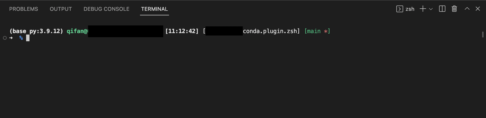

Forked from [ThemysciraData/conda.plugin.zsh](https://github.com/ThemysciraData/conda.plugin.zsh)

# conda.plugin.zsh
Just a tiny little plugin to provide a prompt element for Conda installations and aliases for some base conda functions.


## What to do to install it.

1. Naviagate to `.oh-my-zsh/custom/plugins`
 create a folder named `conda`
2. Copy `conda.plugin.zsh` to the created `conda` folder.
3. Activate the plugin by add `conda` to `plugins` value in `~/.zshrc` file, it looks like `plugins=(git conda)`
4. Add `$(conda_prompt_info)` in the value of your `PROMPT` enviroment. If you are using a theme of `ohmyzsh`, you may need to change the `PROMPT` under the respective theme. E.g., `~/.oh-my-zsh/themes/robbyrussell.zsh-theme`. Mine looks like 
    ```
    PROMPT=$'
    %{$fg_bold[white]%}***$(conda_prompt_info)***%{$reset_color%} %{$fg_bold[green]%}%n@%m  ...'
    ```
5. Run `source ~/.zshrc` or open a new terminal.

## Configuration Variables
Prefix and suffix should be modified in `PROMPT` environment value.
Variable | Description |
--- | --- |
`ZSH_THEME_CONDA_PROMPT_SEPARATOR`| Separator between environment and active python version.|

## Plugin in Action
This screenshot shows the Conda Plugin being used in my custom theme of `crcandy` edition.

